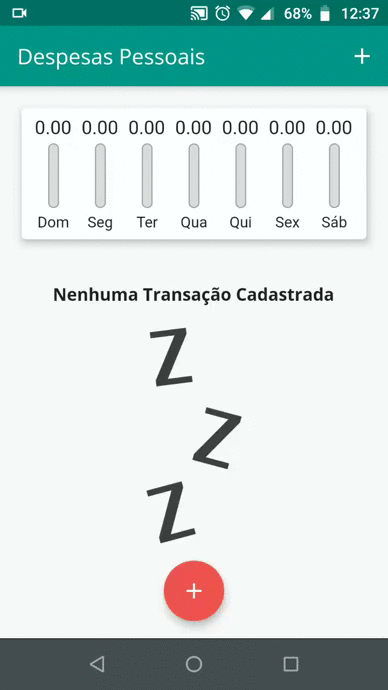
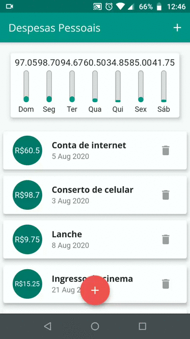

<h1 align="center"> 📲 Expenses App 💸 </h1>

Aplicativo em Flutter para cadastrar as despesas pessoais da semana

  📝 Aplicação desenvolvida seguindo o curso:  
  <a 
    href="https://www.udemy.com/course-dashboard-redirect/?course_id=2710728"
  >
    Aprenda Flutter e Desenvolva Apps Para
    Android e IOS 2020
  </a>

<h2 align="center"> Prints: </h2>

  
  

 

&lt;/&gt; by <a href="http://github.com/yuredev">yuredev</a>
